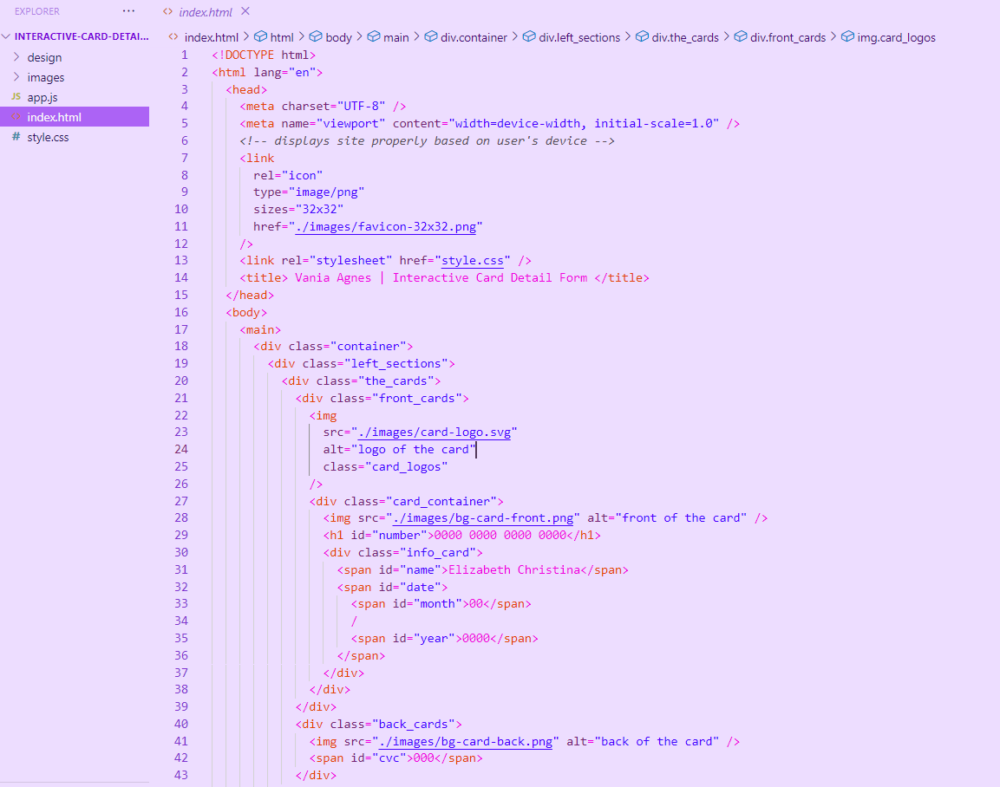

# Quiz 2 - Interactive card detail solution

This is a solution to the [Interactive card detail page Quiz 2 challenge]

## Table of contents

- [Overview](#overview)
  - [The challenge](#the-challenge)
  - [Screenshot](#screenshot)
  - [Links](#links)
- [My process](#my-process)
  - [Built with](#built-with)
  - [What I learned](#what-i-learned)
  - [Continued development](#continued-development)
  - [Useful resources](#useful-resources)
- [Author](#author)
- [Acknowledgments](#acknowledgments)

## Overview

### The challenge

Users should be able to:
- Fill in the form and see the card details update in real-time
- Receive error messages when the form is submitted if:
  - Any input field is empty
  - The card number, expiry date, or CVC fields are in the wrong format
- View the optimal layout depending on their device's screen size
- See hover, active, and focus states for interactive elements on the page

### Screenshot

### Links

- Solution URL: [https://github.com/VaniaAgnes/interactive-card-details-form.git](https://github.com/VaniaAgnes/interactive-card-details-form.git)
- Live Site URL: [https://vaniaagnes.github.io/interactive-card-details-form/](https://vaniaagnes.github.io/interactive-card-details-form/)

## My process
So first thing first, i started this assignment by making the html, then continue with css then javascript 

### Built with

- Semantic HTML5 markup
- CSS custom properties
- Flexbox
- CSS Grid
- [Styled Components](https://styled-components.com/) - For styles

### What I learned
From this assignment i learned the basic of java script and how to implement it, I also learned how to combined java script, html and css together to make my current assignment. 

### Continued development
So i am still a beginner in css and java script so i would like to further improve my skill later on. 

### Useful resources

- [W3School](https://www.w3schools.com/js/js_intro.asp) - This helped me further understand javascript. I really like the pattern shown on this website since it teaches us from the very beginning and step by step. 
- [Java Script Form](https://www.youtube.com/watch?v=bQhD7gCUMNY&ab_channel=JavaScriptFront) - This helped me so much in the assignment it shows us how to do the good coding one by one. 

## Your Detail 

- FullName - [Vania Agnes Djunaedy]
- StudentID - [2602158531]
- BINUS Email - [vania.djunaedy@binus.ac.id]

## Acknowledgments
I would like to give my acknowledgement to a Youtuber called javascript form that helped me finish my assignment and credits to w3school for further helping me understand javascript

